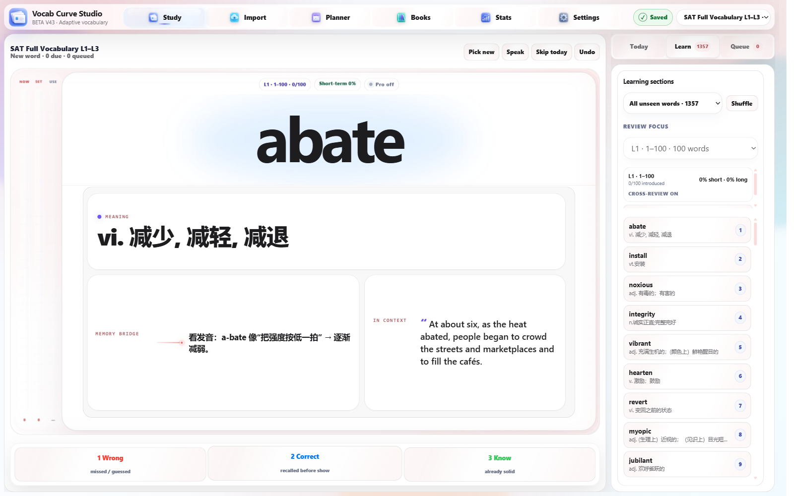

# Vocab Curve Studio Beta v43

Local-first adaptive vocabulary practice that spaces reviews, protects progress, and works offline.

[Open the live app](https://flzsh.github.io/vocab-curve-studio/)

## Why Vocab Curve Studio

- **Adaptive review** keeps the next useful word ready, whether it is new, due, or needs reinforcement.
- **Deliberate spacing** prevents immediate repeats and makes review cycles more meaningful.
- **Durable progress** keeps your books, settings, and study memory in browser-local storage.
- **Offline-ready PWA** keeps practice available when your connection is not.
- **Responsive study views** make the same workflow comfortable on desktop and phone.
- **Optional AI tutor** adds OpenRouter-powered help when you choose to connect it; core study works without it.

## Run locally

1. Download or clone this repository.
2. Run `python3 -m http.server 4173` from the project folder.
3. Open `http://localhost:4173/`.

## Your data

Progress stays in this browser profile and origin. Use a **Full backup** export from Settings before changing browser profiles, devices, folders, or origins, then restore it where you continue studying. OpenRouter is optional; you can use the complete vocabulary workflow without an API key.
